# Find the leads everyone else gets blocked from.

LOGY is a desktop lead-generation crawler. Point it at a niche and a set of cities, or drop in an ICP document, and it finds the businesses, pulls their contact details, scores how weak their online presence is, and hands you a clean export — while a per-request identity engine rotates IPs behind it so the same wall doesn't end your run.

It ships with its own zero-cost search layer, so discovery never depends on a paid SERP API key.

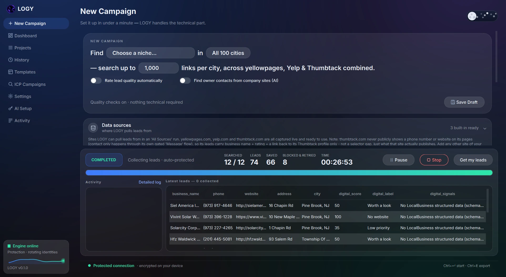

## What is LOGY?

LOGY is a self-contained lead-generation workspace:

- **It crawls real directories** — yellowpages.com, Yelp and Thumbtack are captured and wired in out of the box, and you can add your own site with custom selectors.
- **It rotates identities per request** — proxy pools, Tor circuits, or a hybrid of both, with instant failover the moment a target blocks one.
- **It can start from an ICP** — upload a PDF/DOCX/TXT, review what LOGY understood, discover matching sources through its own search layer, and send the chosen URLs straight into the crawler.
- **It remembers what it already found** — cross-campaign lead memory de-duplicates so re-running a niche surfaces only new leads.
- **Everything lives in one app** — campaign wizard, live tables, history, templates, quality scoring and exports.

No account, no cloud, no per-search fees. Your leads and your database stay on your machine.

## A real campaign, end to end

### Set up the campaign

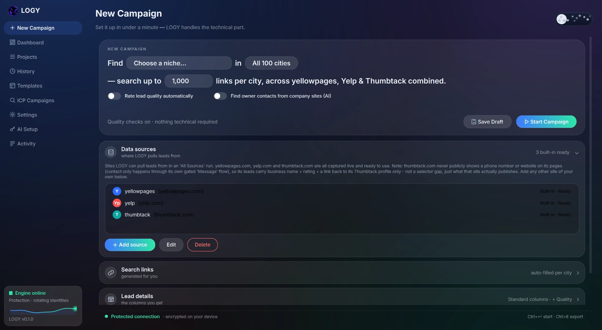

Pick a niche, choose the cities (or run *All Cities*), and decide how many links to search. Turn on **rate lead quality automatically** to score each lead's digital presence, and **find owner contacts from company sites (AI)** to enrich leads from pages they publish themselves.

### Watch the engine work, then read the leads


The run panel reports exactly what happened: pages searched, leads found, leads saved, blocks that were retried, and elapsed time. Below it, the live lead table fills in as records land — with a quality pill per lead (*Worth a look*, *No website*, *Low priority*) and the signals behind it.

### Start from an ICP instead

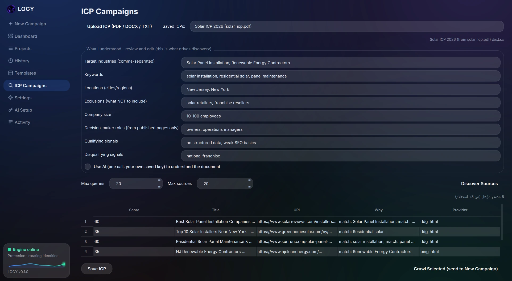

Upload an ICP document and LOGY turns it into a structured profile — industries, keywords, locations, exclusions, company size, roles and qualifying signals — for you to review and edit. **Discover Sources** generates queries, runs them through the internal search layer, and returns a scored list of candidate sources with the reason each one qualified. **Crawl Selected** sends them to the normal campaign flow.

### Track every run

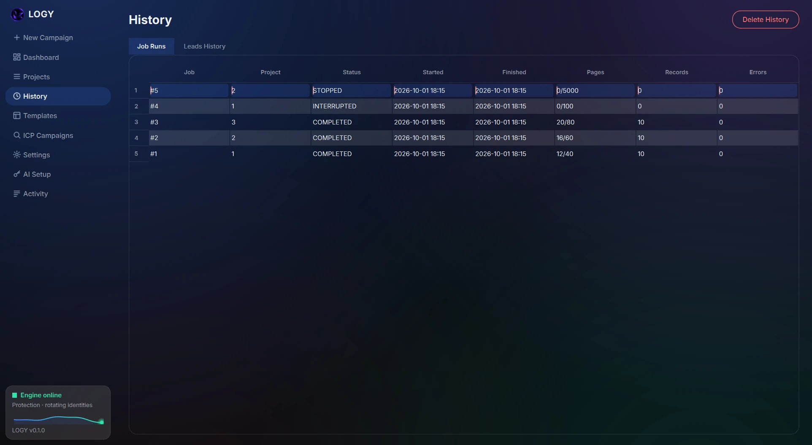

Every campaign is recorded with its status, pages, records and errors. A campaign killed mid-run comes back as **interrupted** and can be resumed from its checkpoint — completed pages are never fetched twice.

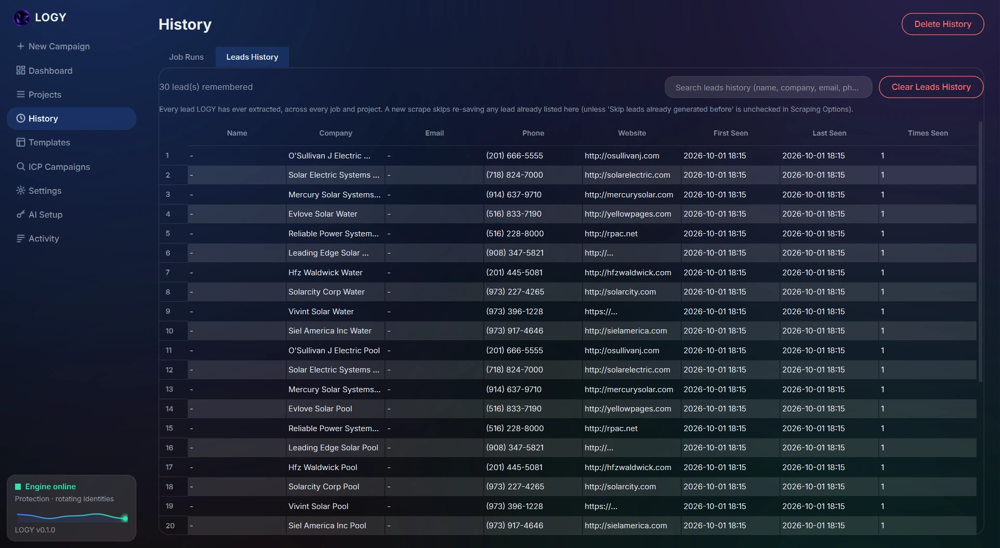

Leads History is the cross-campaign memory: every lead LOGY has ever extracted, de-duplicated, with first-seen and last-seen dates. Fresh campaigns skip anyone already in here, so re-running a niche finds *new* businesses.

### Keep the whole operation in view

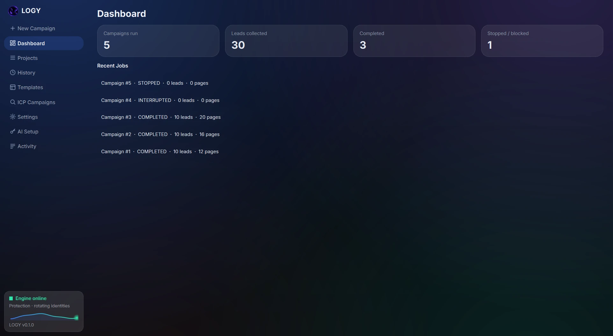

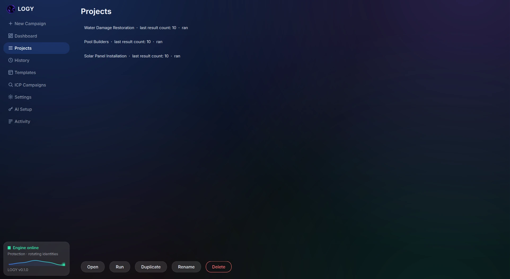

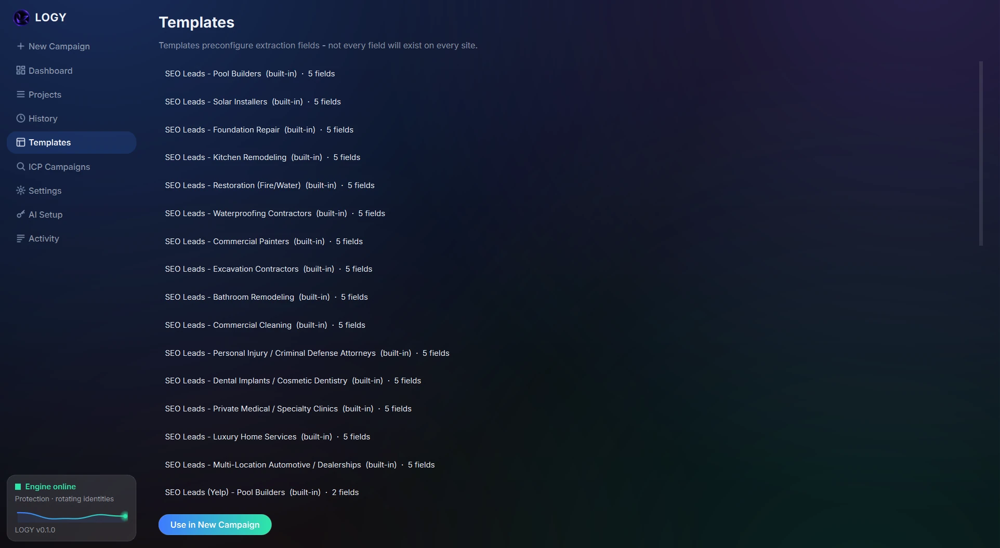

Reusable projects and built-in niche templates mean a new city is two clicks, not a fresh setup.

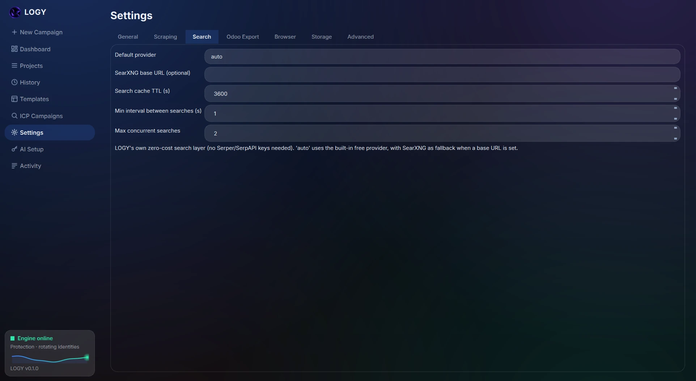

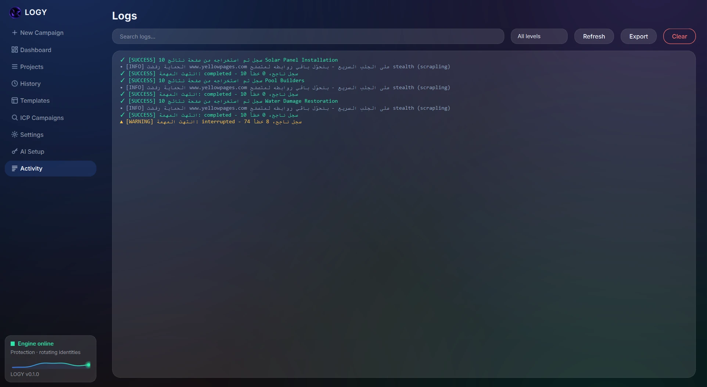

## What you get

- **One wizard, every source** — yellowpages, Yelp, Thumbtack, custom sites, or URLs discovered from an ICP, in the same run.
- **Identity rotation that fails over instantly** — proxy list, single proxy, Tor, or hybrid; a blocked identity is dropped and the retry leaves from a different IP.
- **Stealth when the fast lane is walled** — a `403` on the fast HTTP lane hands the host to a real stealth browser automatically, instead of burning the run against the same wall.
- **Quality scoring built in** — each lead is scored for missing structured data, analytics, meta and more, so the weakest digital presence — your best prospects — sorts to the top. Presets for a range of niches are included.
- **ICP → discovery → crawler** — an internal, zero-cost search layer (`DuckDuckGo` HTML with a `Bing` HTML fallback, optional self-hosted `SearXNG`) discovers sources; the crawler stays the only thing fetching pages.
- **Cross-campaign de-duplication** — remembered leads never come back as new ones.
- **Real exports** — CSV, JSON, JSONL, XLSX, and an Odoo-ready CRM import.
- **AI where it earns its place** — optional AI Auto-Extract (no selectors needed) and owner-contact lookup from a company's own published pages, using your own saved API key.

## How it works

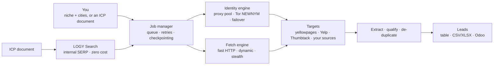

The **UI never touches the scraping engine**: `UI → JobManager → fetch_engine → the scraping engine`. Sources are pluggable profiles, so adding a new site is a profile, not a rewrite.

## Quick start

**Requirements:** Windows (tested on Python 3.14), plus the browser engine's optional dependencies.

```bat
:: 1. install the scraping engine + its browser binaries
pip install "scrapling[fetchers]"
scrapling install

:: 2. run the app
run.bat
```

Or directly:

```bash
pip install -r requirements.txt
pip install "scrapling[fetchers]" && scrapling install
python main.py
```

**Tor (optional, for anonymous runs):** download the Tor Expert Bundle once — LOGY boots it in the background and the `tor` / `hybrid` modes go live as soon as it's reachable:

```bash
python tools/setup_tor.py
```

Then, in the app: **Settings → Search** configures the internal search providers, and the campaign screen's **Scraping options** choose the proxy mode.

## The anonymity engine

### Why identity rotation, and nothing else

Websites never see your MAC address — it dies at the first router. The only network identity a target can observe is your **IP address**. Sites that "block Tor" aren't fingerprinting the browser; they match your IP against the **publicly listed** Tor exit nodes. Disguising the client as Chrome fixes the *fingerprint*; only changing the IP gets past the *gate*.

The historical bug this engine replaced: the UI collected a proxy list, the mode said *Rotating*, but the adapter read `proxies[0]` every time — **one IP for an entire 500-page run**, and a `91/91` failed Yelp wall.

### Proxy modes

| Mode | Rotation | Best for |
|---|---|---|
| No proxy | — | Trusted, robots-friendly targets |
| Single proxy | — | One dedicated exit, low-volume runs |
| **Proxy list** | Cyclic per request + skip-on-block | Paid pools, stable identity set |
| **Tor** | NEWNYM every N requests + on block | Full anonymity, tolerant targets |
| **Hybrid** | Proxies + Tor in one pool; blocked identities skipped instantly | Sites that blanket-block Tor exits |

### The math behind it

**Round-robin rotation** — a pool of `n` identities and a monotonic counter: `identity(t) = pool[(i₀ + t) mod n]`, perfectly uniform after each cycle. Against a WAF that blocks after `m` requests from one IP: single-IP capacity is `m`; rotated capacity is `≈ n·m` — anti-ban capacity grows linearly with pool size.

**Tor circuit rotation** — traffic leaves through a 3-node circuit (Guard → Middle → **Exit**); the target only sees the Exit. `SIGNAL NEWNYM` builds fresh circuits, and with `|E| ≈ 1000–1500` live exits, `P(new exit ≠ old) ≈ 99.9%`.

**Block classification** — a deliberately conservative marker classifier (`403/429/503`, `cloudflare`, `captcha`, `forbidden`, `banned`, `blocked`). False negatives cost a wasted retry; false positives throw away a good identity — so `404` and "connection refused" are *not* markers.

**Instant failover** — on a detected block the engine doesn't wait for the scheduled window; it jumps ahead in the pool (`skip = min(2, n−1)`, so the new identity is never the blocked one) and retries immediately, from a different IP. Retry success is geometric: with a clean-identity probability `q = 0.8`, success reaches **96% by the second try**.

**Hybrid pooling** — user proxies and Tor merge into one pool. If a fraction `f` of the pool is blocked, a double failure needs two independent draws: `f²` instead of `f` (at `f = 0.2`: **4%**, versus 100% on a Tor-only run).

**Exponential backoff** — `min(2^attempt, 10)` seconds. It caps retry storms, and it also scatters timing: deterministic machine-like gaps are their own bot signal.

| Scenario | Without the engine | With the engine |
|---|---|---|
| Requests before first block | ≈ m | ≈ n·m |
| Distinct exit IPs | 1 | 1 + proxies + ~1000 Tor exits |
| Retry success after a block | ≈ 0% | 96% by k=2 |
| Consecutive-failure probability (f=0.2) | 20% | 4% |

### Honest limits

- **Behavioural fingerprinting is out of scope.** Targets like Yelp also model request ordering and JS execution; rotation says nothing there — that is the stealth engine's job (stealth Chromium + Cloudflare solving).
- **A target that blocks every Tor exit and every datacenter range** leaves only residential proxies.
- **MAC rotation is not implemented, on purpose** — it cannot help against websites.
- **No CAPTCHA solving bypass and no controls circumvention.** When a source blocks automated access, LOGY fails over or reports it — it does not try to defeat the protection.
- **Respect the sites you crawl.** `robots.txt` is honoured when enabled, and you are responsible for the terms of the sources you point it at.

### No automated LinkedIn people-search, by design

LOGY can read an owner's LinkedIn URL **if a company publishes it on its own site**. It never searches LinkedIn for a person. That is a different risk category — anti-bot measures plus privacy law around processing identifiable individuals — so it is deliberately not built.

## Included sources

| Source | Status | Notes |
|---|---|---|
| yellowpages.com | Built-in, verified | Niche + city search, paginated |
| Yelp | Built-in, verified | Stealth engine; respects `robots.txt` |
| Thumbtack | Built-in, verified | What the site actually publishes (business, rating, profile link) |
| Your own site | Custom source | Add a domain + container/field selectors from inside the app |
| ICP-discovered sources | Automatic | Found by the internal search layer and qualified against your ICP |

## Tests

```bash
python -m pytest tests/ -q
```

216 tests cover storage, the job manager and resume flow, the fetch engine, the anonymity helpers, extraction, de-duplication, the search schema/providers/service/API, and the ICP module.

## Layout

```
app/
  core/
    engine/        # fetch_engine, anonymity, brain, extractor, ai_extractor,
                   # builtin_templates, dedupe, qualifier, tor_runtime
    search/        # LOGY Search: providers, service, schema, urls, icp, metrics, api
    job_manager.py # QThread worker: queue, retries, failover, enrichment
    exports/       # CSV / JSON / JSONL / XLSX / Odoo exporters
    storage/       # db.py (thread-safe sqlite3), secrets.py (DPAPI-backed)
  ui/              # main_window, sidebar, theme (dark QSS), screens/, widgets/, dialogs/
docs/assets/readme # README screenshots and banner
main.py            # entry point
run.bat            # Windows launcher
```

## License

MIT © 2026 Neutron. See [LICENSE](LICENSE).
